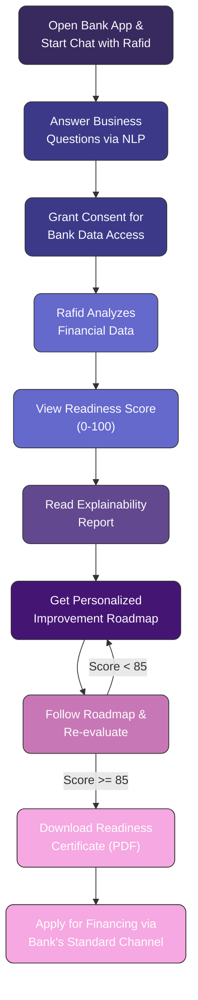
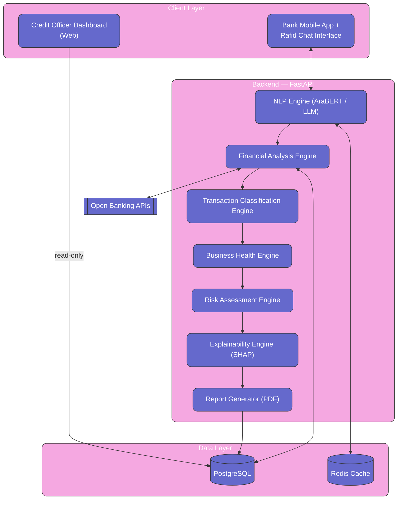
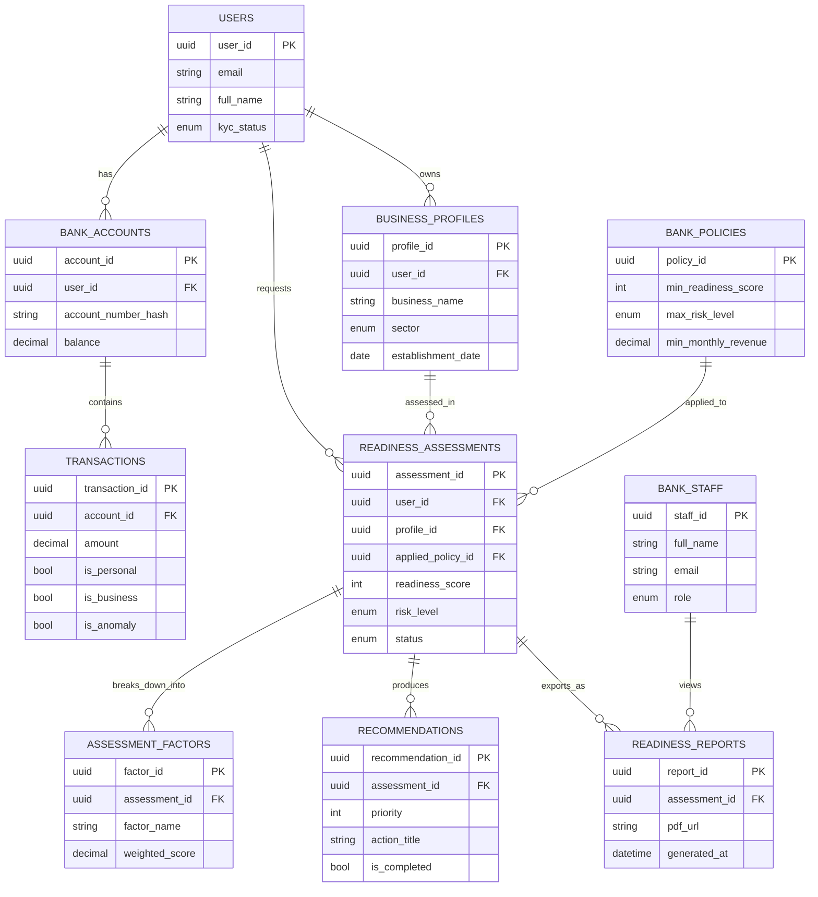
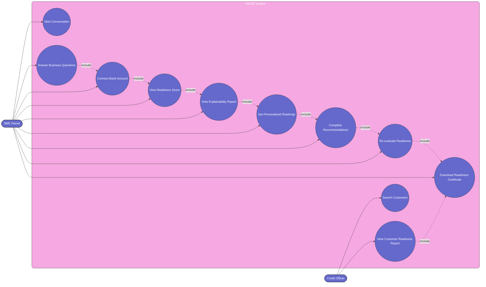
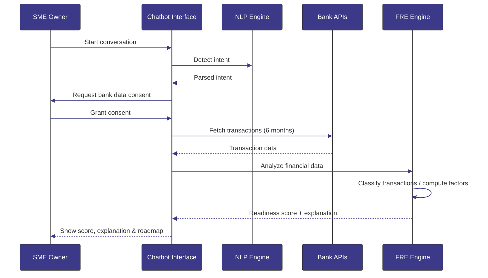
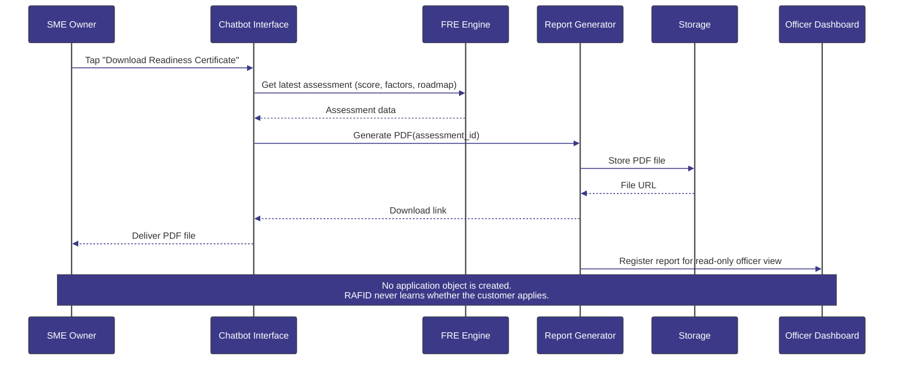
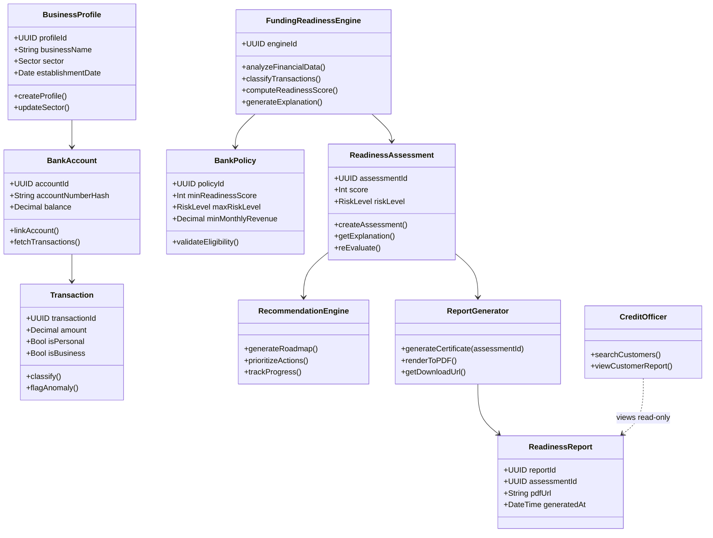
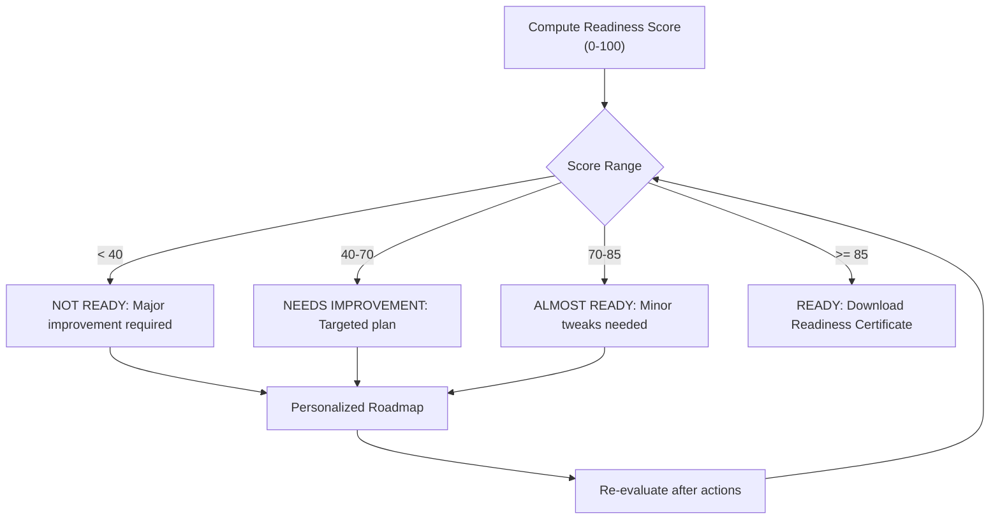

# RAFID — Funding Readiness Engine | رافد — محرك جاهزية التمويل

> **Amad 2026 Hackathon** — FinTech Track

---

## Table of Contents | جدول المحتويات

1. [Executive Summary | ملخص تنفيذي](#exec-summary)
2. [Problem Statement | بيان المشكلة](#prob-statement)
3. [Solution Overview | نظرة على الحل](#sol-overview)
4. [System Architecture | هيكل النظام](#sys-arch)
5. [Database Design | تصميم قواعد البيانات](#db-design)
6. [UML Diagrams | مخططات UML](#uml-diagrams)
7. [API Specification | تفاصيل API](#api-spec)
8. [Algorithms & Scoring Engine | الخوارزميات ومحرك التسجيل](#algo-engine)
9. [User Stories | قصص المستخدم](#user-stories)
10. [Security, Access Control & Key Requirements | الأمن والصلاحيات والمتطلبات الأساسية](#security-comp)
11. [Team | الفريق](#team)
12. [Appendix | الملحق](#appendix)

---

## <a name="exec-summary"></a>1. Executive Summary | ملخص تنفيذي

**RAFID** (رافد) is an AI-powered financial assistant (ChatBot) embedded within the bank's mobile application. It serves as a **pre-loan-application guidance and analysis layer** for SME (Small and Medium Enterprise) owners seeking financing.

**Its goal** is NOT to approve or reject loan applications, and it does **not** process, submit, or track loan applications in any way. RAFID analyzes the client's financial data, identifies weaknesses that could lead to application rejection, and provides practical recommendations to improve readiness.

Once the client reaches the readiness threshold, RAFID issues a downloadable **Readiness Certificate (PDF)**, and the client proceeds to apply for financing through the **bank's normal, existing application channel** — RAFID plays no part in that process beyond having prepared the client for it.
#

**رافد** هو مساعد مالي ذكي يعمل بتقنية الذكاء الاصطناعي (برنامج دردشة ذكي) مُدمج داخل تطبيق الهاتف المحمول الخاص بالبنك، ويعمل كطبقة توجيه وتحليل قبل تقديم طلبات القروض لأصحاب المشاريع الصغيرة والمتوسطة.

**هدف رافد** ليس الموافقة على طلبات القروض أو رفضها، كما أنه **لا يعالج ولا يستقبل ولا يتتبّع** أي طلب تمويل بأي شكل. يحلل رافد البيانات المالية للعميل، يحدد نقاط الضعف، ويقدّم توصيات عملية للتحسين. عند وصول العميل لدرجة الجاهزية المطلوبة، يصدر رافد **شهادة جاهزية (PDF)** قابلة للتحميل، ثم يقدّم العميل طلبه عبر **القناة الاعتيادية للبنك** — دور رافد ينتهي عند هذه النقطة تماماً.

---

## <a name="prob-statement"></a>2. Problem Statement | بيان المشكلة

### Pain Points for SME Owners
1. **Account Mixing:** Personal and business finances are combined
2. **Rejection Confusion:** No understanding of loan rejection reasons
3. **Lack of Guidance:** No clear roadmap for improvement
4. **Low Visibility:** No clear view of financial readiness

### Pain Points for Bank
1. **High Volume of Unqualified Applications:** Credit officers spend time and effort reviewing unqualified applications
2. **Late Assessment:** Loan-application evaluation happens AFTER application, not BEFORE
3. **Increased Risk:** Unprepared borrowers have higher default rates
4. **Poor Customer Experience:** Rejection without constructive feedback

#

### التحديات التي تواجه أصحاب المشاريع الصغيرة والمتوسطة
1. **دمج الحسابات:** يتم دمج الأموال الشخصية والتجارية
2. **حيرة من الرفض:** عدم فهم أسباب رفض القروض
3. **نقص التوجيه:** لا توجد خطة واضحة للتحسين
4. **قلة الشفافية:** لا توجد رؤية واضحة للجاهزية المالية

### التحديات التي تواجه البنوك
1. **كثرة الطلبات غير المؤهلة:** يهدر موظفو الائتمان وقتًا وجهدًا في مراجعة طلبات غير مؤهلة
2. **التقييم المتأخر:** يتم تقييم جاهزية المنشأة للحصول على قرض بعد تقديم الطلب، وليس قبله
3. **زيادة المخاطر:** ترتفع معدلات التخلف عن السداد لدى المقترضين غير المستعدين
4. **تجربة عملاء سيئة:** الرفض دون تقديم ملاحظات بناءة

---

## <a name="sol-overview"></a>3. Solution Overview | نظرة على الحل

### 3.1 What is RAFID? | ما هو رافد؟

RAFID is NOT just a chatbot. It is a Funding Readiness Engine that includes low-score explainability and actionable improvement guidance — and nothing beyond that. It has **no visibility or role** in the bank's actual loan origination, underwriting, or approval systems.

رافد ليس مجرد برنامج دردشة آلي. إنه محرك يحلل جاهزية العملاء للتمويل، يتضمن شرحًا للدرجات المنخفضة وتوجيهات عملية للتحسين — ولا يتجاوز ذلك. **لا صلاحية ولا دور له** في أنظمة البنك الفعلية لمعالجة القروض أو اعتمادها.

### 3.2 Core Outputs | المخرجات الأساسية

| Output | Description |
|--------|-------------|
| **Funding Readiness Score** | 0-100 score representing financial readiness |
| **Explainability Report** | SHAP-based explanation of why the score is what it is |
| **Personalized Roadmap** | Step-by-step action plan to improve the score |
| **Readiness Certificate (PDF)** | A downloadable PDF summarizing the score, explanation, and completed roadmap — used by the client as supporting evidence when applying through the bank's standard channel |
#

| المخرجات | الوصف |
|--------|-------------|
| **معدل جاهزية التمويل** | معدل من 0-100 يمثل الجاهزية للتمويل |
| **تقرير الشرح** | يشرح سبب كون النتيجة على ما هي عليه |
| **خارطة طريق مخصصة** | خطة عمل خطوة بخطوة لتحسين النتيجة |
| **شهادة الجاهزية (PDF)** | مستند PDF قابل للتحميل يلخّص الدرجة والتفسير وخطة التحسين المُنجزة، يستخدمه العميل كمستند داعم عند التقديم عبر القناة الاعتيادية للبنك |
#

### 3.3 User Journey | رحلة المستخدم



---

## <a name="sys-arch"></a>4. System Architecture | هيكل النظام

### 4.1 High-Level Architecture



#

### 4.2 Component Details | تفاصيل المكونات

#### 4.2.1 Financial Analysis Engine (FAE) | محرك التحليل المالي

| Module | Function | Weight |
|--------|----------|--------|
| Cash Flow Stability | Analyzes monthly net cash flow variance | 25% |
| Revenue Consistency | Measures income regularity and trends | 20% |
| Expense Pattern | Identifies spending anomalies and ratios | — |

| الوحدة | الوظيفة | الوزن |
|--------|----------|--------|
| استقرار التدفق النقدي | يحلل تباين صافي التدفق النقدي الشهري | 25% |
| اتساق الإيرادات | يقيس انتظام الإيرادات واتجاهاتها | 20% |
| نمط المصروفات | يحدد حالات الشذوذ في الإنفاق ونسبه | — |
#

#### 4.2.2 Transaction Classification Engine (TCE) | محرك تصنيف المعاملات
Classifies each transaction as personal or business (target accuracy ≥ 85%) and flags anomalies.

يصنف كل معاملة على أنها شخصية أو تجارية (دقة مستهدفة ≥ 85٪) ويشير إلى الحالات الشاذة.
#

#### 4.2.3 Business Health Engine (BHE) | محرك صحة الأعمال
Scores business maturity, sector viability, and operational stability.

يقيّم نضج الأعمال، وجدوى القطاع، والاستقرار التشغيلي.

#### 4.2.4 Risk Assessment Engine (RAE) | محرك تقييم المخاطر
Aggregates behavioral, structural, and external risk indicators into a single risk profile.

يجمع مؤشرات المخاطر السلوكية والهيكلية والخارجية في ملف تعريف واحد للمخاطر.
#

#### 4.2.5 Explainability Engine (XEE) | محرك التفسير
Produces SHAP-based, Arabic-language explanations for each of the six scoring factors.

يقدم تفسيرات باللغة العربية تستند إلى نموذج SHAP لكل عامل من عوامل التقييم الستة.
#

#### 4.2.6 Report Generator (RGM) | مولّد التقارير 
Compiles the latest assessment (score + explanation + roadmap progress) into a single downloadable **Readiness Certificate PDF**. it has no knowledge of or integration with the bank's loan processing systems — it only reads from Rafed evaluation data and writes a PDF file.

يجمّع أحدث تقييم (الدرجة + التفسير + تقدّم خارطة الطريق) في ملف **PDF واحد قابل للتحميل**. لا يملك أي معرفة أو تكامل مع أنظمة معالجة القروض في البنك — يقرأ فقط من بيانات تقييم رافد ويكتب ملف PDF.
#

### 4.3 Technology Stack | مجموعة التقنيات

| Layer | Technology | Purpose |
|-------|------------|---------|
| **Frontend** | Flutter / React Native | Mobile app + chat interface |
| **Backend** | FastAPI (Python) | APIs + business logic |
| **Database** | PostgreSQL + Redis | Structured data + cache |
| **AI/NLP** | LLM + AraBERT | Arabic conversation understanding |
| **ML** | scikit-learn / TensorFlow | Transaction classification + scoring |
| **Explainability** | SHAP + Rule Engine | XAI reports |
| **PDF Generation** | WeasyPrint (HTML/CSS → PDF) | Readiness Certificate rendering, native Arabic RTL support |
| **Integration** | Open Banking APIs | Bank data access |
| **DevOps** | Docker + GitHub Actions | Containerized local/demo deployment + CI |

---

## <a name="db-design"></a>5. Database Design | تصميم قواعد البيانات

### 5.1 Entity Relationship Diagram (ERD) | تصميم قاعدة البيانات



### 5.2 Complete SQL Schema | قاعدة البيانات

Only the two new tables are shown below — the rest of the schema (users, business_profiles, bank_accounts, transactions, bank_policies, readiness_assessments, assessment_factors, recommendations) is unchanged.

```sql
-- ============================================================
-- RAFID - Complete Database Schema
-- ============================================================

CREATE EXTENSION IF NOT EXISTS "uuid-ossp";

-- ENUMs
CREATE TYPE user_kyc_status AS ENUM ('pending', 'verified', 'rejected');
CREATE TYPE business_sector AS ENUM ('retail', 'restaurant', 'ecommerce', 'services', 'manufacturing', 'construction', 'technology', 'healthcare', 'other');
CREATE TYPE account_type AS ENUM ('checking', 'savings', 'business');
CREATE TYPE transaction_type AS ENUM ('credit', 'debit');
CREATE TYPE risk_level AS ENUM ('low', 'medium', 'high', 'critical');
CREATE TYPE assessment_status AS ENUM ('active', 'expired', 'superseded');
CREATE TYPE recommendation_category AS ENUM ('revenue', 'expenses', 'organization', 'documentation', 'planning', 'bank_requirement');

-- Users
CREATE TABLE users (
    user_id UUID PRIMARY KEY DEFAULT uuid_generate_v4(),
    email VARCHAR(255) UNIQUE NOT NULL,
    phone VARCHAR(20) UNIQUE,
    full_name VARCHAR(255),
    kyc_status user_kyc_status DEFAULT 'pending',
    created_at TIMESTAMP WITH TIME ZONE DEFAULT NOW(),
    updated_at TIMESTAMP WITH TIME ZONE DEFAULT NOW()
);

-- Business Profiles
CREATE TABLE business_profiles (
    profile_id UUID PRIMARY KEY DEFAULT uuid_generate_v4(),
    user_id UUID NOT NULL REFERENCES users(user_id) ON DELETE CASCADE,
    business_name VARCHAR(255),
    sector business_sector,
    establishment_date DATE,
    employees_count INT CHECK (employees_count >= 0),
    revenue_model VARCHAR(100),
    registration_no VARCHAR(100),
    has_financial_statements BOOLEAN DEFAULT FALSE,
    created_at TIMESTAMP WITH TIME ZONE DEFAULT NOW(),
    updated_at TIMESTAMP WITH TIME ZONE DEFAULT NOW()
);

-- Bank Accounts
CREATE TABLE bank_accounts (
    account_id UUID PRIMARY KEY DEFAULT uuid_generate_v4(),
    user_id UUID NOT NULL REFERENCES users(user_id) ON DELETE CASCADE,
    account_number_hash VARCHAR(255) NOT NULL,
    bank_code VARCHAR(10),
    account_type account_type,
    balance DECIMAL(15,2) DEFAULT 0.00,
    currency CHAR(3) DEFAULT 'SAR',
    opened_at TIMESTAMP WITH TIME ZONE,
    is_active BOOLEAN DEFAULT TRUE,
    created_at TIMESTAMP WITH TIME ZONE DEFAULT NOW()
);

-- Transactions
CREATE TABLE transactions (
    transaction_id UUID PRIMARY KEY DEFAULT uuid_generate_v4(),
    account_id UUID NOT NULL REFERENCES bank_accounts(account_id) ON DELETE CASCADE,
    amount DECIMAL(15,2) NOT NULL,
    currency CHAR(3) DEFAULT 'SAR',
    transaction_type transaction_type NOT NULL,
    description TEXT,
    category_ml VARCHAR(50),
    category_confidence DECIMAL(4,3) CHECK (category_confidence BETWEEN 0 AND 1),
    is_personal BOOLEAN,
    is_business BOOLEAN,
    is_anomaly BOOLEAN DEFAULT FALSE,
    anomaly_score DECIMAL(4,3) CHECK (anomaly_score BETWEEN 0 AND 1),
    timestamp TIMESTAMP WITH TIME ZONE NOT NULL,
    created_at TIMESTAMP WITH TIME ZONE DEFAULT NOW()
);

-- Bank Policies (Side 1 of 1:N relationship)
CREATE TABLE bank_policies (
    policy_id UUID PRIMARY KEY DEFAULT uuid_generate_v4(),
    policy_name VARCHAR(255) NOT NULL,
    min_readiness_score INT CHECK (min_readiness_score BETWEEN 0 AND 100),
    max_risk_level risk_level,
    min_monthly_revenue DECIMAL(15,2),
    min_account_age_months INT,
    sector_restrictions JSONB,
    scoring_weights JSONB,
    is_active BOOLEAN DEFAULT TRUE,
    version VARCHAR(10) DEFAULT '1.0',
    effective_from TIMESTAMP WITH TIME ZONE DEFAULT NOW(),
    effective_to TIMESTAMP WITH TIME ZONE,
    created_at TIMESTAMP WITH TIME ZONE DEFAULT NOW(),
    updated_at TIMESTAMP WITH TIME ZONE DEFAULT NOW()
);

-- Readiness Assessments (Side N of 1:N relationship with BankPolicies)
CREATE TABLE readiness_assessments (
    assessment_id UUID PRIMARY KEY DEFAULT uuid_generate_v4(),
    user_id UUID NOT NULL REFERENCES users(user_id) ON DELETE CASCADE,
    profile_id UUID REFERENCES business_profiles(profile_id),
    applied_policy_id UUID REFERENCES bank_policies(policy_id),
    policy_version VARCHAR(10),
    readiness_score INT CHECK (readiness_score BETWEEN 0 AND 100),
    risk_level risk_level,
    assessment_version VARCHAR(10) DEFAULT '1.0',
    status assessment_status DEFAULT 'active',
    expires_at TIMESTAMP WITH TIME ZONE,
    created_at TIMESTAMP WITH TIME ZONE DEFAULT NOW()
);

-- Assessment Factors
CREATE TABLE assessment_factors (
    factor_id UUID PRIMARY KEY DEFAULT uuid_generate_v4(),
    assessment_id UUID NOT NULL REFERENCES readiness_assessments(assessment_id) ON DELETE CASCADE,
    factor_name VARCHAR(50) NOT NULL,
    weight DECIMAL(4,2) CHECK (weight BETWEEN 0 AND 1),
    raw_score DECIMAL(5,2) CHECK (raw_score BETWEEN 0 AND 100),
    weighted_score DECIMAL(5,2),
    explanation TEXT,
    created_at TIMESTAMP WITH TIME ZONE DEFAULT NOW()
);

-- Recommendations
CREATE TABLE recommendations (
    recommendation_id UUID PRIMARY KEY DEFAULT uuid_generate_v4(),
    assessment_id UUID NOT NULL REFERENCES readiness_assessments(assessment_id) ON DELETE CASCADE,
    priority INT CHECK (priority BETWEEN 1 AND 5),
    category recommendation_category,
    action_title VARCHAR(255),
    action_description TEXT,
    expected_impact VARCHAR(100),
    estimated_duration_days INT,
    is_completed BOOLEAN DEFAULT FALSE,
    completed_at TIMESTAMP WITH TIME ZONE,
    created_at TIMESTAMP WITH TIME ZONE DEFAULT NOW()
);

-- Conversations
CREATE TABLE conversations (
    conversation_id UUID PRIMARY KEY DEFAULT uuid_generate_v4(),
    user_id UUID NOT NULL REFERENCES users(user_id) ON DELETE CASCADE,
    session_id UUID DEFAULT uuid_generate_v4(),
    message_text TEXT,
    intent VARCHAR(50),
    sentiment VARCHAR(20),
    timestamp TIMESTAMP WITH TIME ZONE DEFAULT NOW(),
    is_bot BOOLEAN DEFAULT FALSE
);

-- Audit Logs
CREATE TABLE audit_logs (
    log_id UUID PRIMARY KEY DEFAULT uuid_generate_v4(),
    user_id UUID REFERENCES users(user_id),
    action_type VARCHAR(50),
    entity_type VARCHAR(50),
    entity_id UUID,
    old_value JSONB,
    new_value JSONB,
    timestamp TIMESTAMP WITH TIME ZONE DEFAULT NOW(),
    ip_address INET
);

-- External Data
CREATE TABLE external_data (
    external_id UUID PRIMARY KEY DEFAULT uuid_generate_v4(),
    user_id UUID REFERENCES users(user_id),
    source_type VARCHAR(50),
    data_payload JSONB,
    fetched_at TIMESTAMP WITH TIME ZONE DEFAULT NOW(),
    reliability_score DECIMAL(4,3) CHECK (reliability_score BETWEEN 0 AND 1)
);

-- Indexes
CREATE INDEX idx_transactions_account ON transactions(account_id);
CREATE INDEX idx_transactions_timestamp ON transactions(timestamp);
CREATE INDEX idx_transactions_anomaly ON transactions(is_anomaly) WHERE is_anomaly = TRUE;
CREATE INDEX idx_assessments_user ON readiness_assessments(user_id);
CREATE INDEX idx_assessments_policy ON readiness_assessments(applied_policy_id);
CREATE INDEX idx_factors_assessment ON assessment_factors(assessment_id);
CREATE INDEX idx_recommendations_assessment ON recommendations(assessment_id);

-- Default Policy Insert
INSERT INTO bank_policies (policy_id, policy_name, min_readiness_score, max_risk_level, 
    min_monthly_revenue, min_account_age_months, scoring_weights, version)
VALUES (uuid_generate_v4(), 'SME_Funding_Standard_2026', 70, 'high', 15000.00, 6,
    '{"cash_flow_stability": 0.25, "account_separation": 0.20, "revenue_consistency": 0.20, 
      "business_age_sector": 0.15, "risk_profile": 0.10, "user_engagement": 0.10}'::JSONB, '1.0');

CREATE TABLE readiness_reports (
    report_id UUID PRIMARY KEY DEFAULT uuid_generate_v4(),
    assessment_id UUID NOT NULL REFERENCES readiness_assessments(assessment_id) ON DELETE CASCADE,
    pdf_url TEXT NOT NULL,
    generated_at TIMESTAMP WITH TIME ZONE DEFAULT NOW()
);

-- Bank Staff (single role for MVP: credit_officer)
CREATE TYPE staff_role AS ENUM ('credit_officer');

CREATE TABLE bank_staff (
    staff_id UUID PRIMARY KEY DEFAULT uuid_generate_v4(),
    full_name VARCHAR(255) NOT NULL,
    email VARCHAR(255) UNIQUE NOT NULL,
    role staff_role DEFAULT 'credit_officer',
    created_at TIMESTAMP WITH TIME ZONE DEFAULT NOW()
);

CREATE INDEX idx_reports_assessment ON readiness_reports(assessment_id);
```

---

## <a name="uml-diagrams"></a>6. UML Diagrams | مخططات UML

### 6.1 Use Case Diagram


#

### 6.2 Sequence Diagrams | مخططات التسلسل

#### 6.2.1 Assessment Flow


#

#### 6.2.2 Readiness Certificate Generation *(New)*



### 6.3 Class Diagram



---

## <a name="api-spec"></a>7. API Specification | تفاصيل API

### 7.1 Authentication
| Method | Endpoint | Description |
|--------|----------|-------------|
| POST | /api/v1/auth/login | Customer login |
| POST | /api/v1/auth/staff-login | Credit officer login |
| POST | /api/v1/auth/refresh | Refresh token |

### 7.2 User & Profile
| Method | Endpoint | Description |
|--------|----------|-------------|
| GET | /api/v1/users/me | Get current user |
| POST | /api/v1/profiles | Create business profile |
| PUT | /api/v1/profiles/{id} | Update business profile |

### 7.3 Bank Connection
| Method | Endpoint | Description |
|--------|----------|-------------|
| POST | /api/v1/bank-accounts/connect | Connect account via Open Banking consent |
| GET | /api/v1/bank-accounts | List connected accounts |

### 7.4 Assessment (FRE)
| Method | Endpoint | Description |
|--------|----------|-------------|
| POST | /api/v1/assessments | Trigger new assessment |
| GET | /api/v1/assessments | List assessment history |
| GET | /api/v1/assessments/{id} | Get assessment details |
| GET | /api/v1/assessments/{id}/factors | Factor breakdown |
| GET | /api/v1/assessments/{id}/explanation | XAI explanation |
| POST | /api/v1/assessments/{id}/re-evaluate | Re-evaluate |

### 7.5 Recommendations
| Method | Endpoint | Description |
|--------|----------|-------------|
| GET | /api/v1/assessments/{id}/recommendations | Get recommendations |
| PUT | /api/v1/recommendations/{id}/complete | Mark as completed |
| GET | /api/v1/assessments/{id}/roadmap | Full roadmap |

### 7.6 Chatbot
| Method | Endpoint | Description |
|--------|----------|-------------|
| POST | /api/v1/chat/sessions | Start session |
| POST | /api/v1/chat/sessions/{id}/messages | Send message |
| GET | /api/v1/chat/sessions/{id}/messages | Get history |
| DELETE | /api/v1/chat/sessions/{id} | End session |

### 7.7 Readiness Certificate
| Method | Endpoint | Description |
|--------|----------|-------------|
| POST | /api/v1/assessments/{id}/report | Generate the Readiness Certificate (PDF) |
| GET | /api/v1/reports/{id} | Download the certificate |

### 7.8 Credit Officer Dashboard 
| Method | Endpoint | Description |
|--------|----------|-------------|
| GET | /api/v1/officer/customers?search=&sector=&min_score=&status= | Search / filter customer list |
| GET | /api/v1/officer/customers/{user_id} | Customer profile + latest assessment |
| GET | /api/v1/officer/customers/{user_id}/report | View the customer's Readiness Certificate (read-only) |
| GET | /api/v1/officer/dashboard/summary | Simple aggregate counts (total customers, avg. score, # ready) |


---

## <a name="algo-engine"></a>8. Algorithms & Scoring Engine | الخوارزميات ومحرك التسجيل

### 8.1 Funding Readiness Score Formula | معادلة تقييم جاهزية التمويل

```
Score = Σ (Factor_Raw_Score × Weight × Sector_Adjustment) - Risk_Penalty
```
#

### 8.2 Six Factors | ستة عوامل

| Factor | Weight | Description | Calculation |
|--------|--------|-------------|-------------|
| **F1: Cash Flow Stability** | 25% | Monthly net cash flow variance | `100 - (CV × 100)`, where CV = std/mean |
| **F2: Account Separation** | 20% | Personal vs business transaction ratio | `100 - (mixing_ratio × 100)` |
| **F3: Revenue Consistency** | 20% | Income regularity and trend | `100 - (CV × 50) - trend_penalty` |
| **F4: Business Age & Sector** | 15% | Maturity and sector viability | `age_score × 0.4 + sector_viability × 0.4 + employee_score × 0.2` |
| **F5: Risk Profile** | 10% | Behavioral, structural, external risks | `100 - avg(risk_indicators)` |
| **F6: User Engagement** | 10% | Data quality and user interaction | `connected(40) + profile(30) + documents(20) + re-evaluated(10)` |

| العامل | الوزن | الوصف | الحساب |
|--------|--------|-------------|-------------|
| **العامل 1: استقرار التدفق النقدي** | 25% | تباين صافي التدفق النقدي الشهري | `100 - (معامل التباين × 100)` |
| **العامل 2: فصل الحسابات** | 20% | نسبة المعاملات الشخصية إلى معاملات الأعمال | `100 - (نسبة الخلط × 100)` |
| **العامل 3: اتساق الإيرادات** | 20% | انتظام الدخل واتجاهه | `100 - (معامل التباين × 50) - عقوبة الاتجاه` |
| **العامل 4: عمر النشاط والقطاع** | 15% | النضج وجدوى القطاع | `age_score × 0.4 + sector_viability × 0.4 + employee_score × 0.2` |
| **العامل 5: ملف المخاطر** | 10% | المخاطر السلوكية والهيكلية والخارجية | `100 - متوسط(مؤشرات المخاطر)` |
| **العامل 6: تفاعل المستخدم** | 10% | جودة البيانات وتفاعل المستخدم | `connected(40) + profile(30) + documents(20) + re-evaluated(10)` |
#

### 8.3 Decision Branches & Flow

| Score Range | Status | Action |
|-------------|--------|--------|
| < 40 | NOT READY | Major improvement required |
| 40-70 | NEEDS IMPROVEMENT | Targeted improvement plan |
| 70-85 | ALMOST READY | Minor tweaks needed |
| ≥ 85 | READY | Download Readiness Certificate |
#


#

### 8.4 Key Algorithms | الخوارزميات الأساسية

#### Account Mix Detection
```python
def calculate_account_separation(transactions):
    total = len(transactions)
    personal_count = sum(1 for t in transactions if t.is_personal)
    business_count = sum(1 for t in transactions if t.is_business)

    mixing_ratio = (total - personal_count - business_count) / total
    separation_score = 100 - (mixing_ratio * 100)

    return separation_score
```
#

#### Cash Flow Analysis
```python
def analyze_cash_flow(transactions, months=6):
    monthly_net = [sum(inflows) - sum(outflows) for month in last_n_months]

    mean_net = np.mean(monthly_net)
    std_net = np.std(monthly_net)
    cv = std_net / abs(mean_net) if mean_net != 0 else float('inf')

    stability_score = max(0, 100 - (cv * 100))
    return stability_score
```
#

#### Anomaly Detection
```python
def detect_anomalies(transactions):
    features = [[tx.amount, tx.timestamp.hour, tx.timestamp.weekday(),
                 len(tx.description)] for tx in transactions]

    clf = IsolationForest(contamination=0.05)
    predictions = clf.fit_predict(features)

    anomalies = [tx for i, tx in enumerate(transactions) if predictions[i] == -1]
    return anomalies
```

---

## <a name="user-stories"></a>9. User Stories | قصص المستخدم

### Epic 1: Onboarding & Discovery
- US-001: As an SME owner, I want to start a conversation in Arabic
- US-002: As an SME owner, I want to answer simple business questions
- US-003: As an SME owner, I want to connect my bank account securely
- US-004: As an SME owner, I want to see my data usage and consent terms

### المرحلة الأولى: الإعداد والاكتشاف
- US-001: بصفتي صاحب مشروع صغير أو متوسط، أرغب في بدء محادثة باللغة العربية.
- US-002: بصفتي صاحب مشروع صغير أو متوسط، أرغب في الإجابة على أسئلة تجارية بسيطة.
- US-003: بصفتي صاحب مشروع صغير أو متوسط، أرغب في ربط حسابي المصرفي بشكل آمن.
- US-004: بصفتي صاحب مشروع صغير أو متوسط، أرغب في الاطلاع على شروط استخدام بياناتي وشروط الموافقة.
#

### Epic 2: Assessment & Insights 
- US-005: As an SME owner, I want to see my Funding Readiness Score
- US-006: As an SME owner, I want to understand why my score is what it is
- US-007: As an SME owner, I want to see flagged personal transactions
- US-008: As an SME owner, I want to see my cash flow trends

### المرحلة الثانية: التقييم والرؤى
- US-005: باعتباري مالك شركة صغيرة ومتوسطة الحجم، أريد أن أرى درجة الاستعداد للتمويل الخاصة بي
- US-006: باعتباري مالك شركة صغيرة ومتوسطة الحجم، أريد أن أفهم سبب وصول نتيجتي إلى ما هي عليه
- US-007: باعتباري مالك شركة صغيرة ومتوسطة الحجم، أريد رؤية المعاملات الشخصية التي تم الإبلاغ عنها
- US-008: باعتباري مالك شركة صغيرة ومتوسطة الحجم، أريد أن أرى اتجاهات التدفق النقدي الخاصة بي
#

### Epic 3: Improvement & Re-evaluation
- US-009: As an SME owner, I want a personalized action plan
- US-010: As an SME owner, I want to mark actions as completed
- US-011: As an SME owner, I want to re-evaluate after improvements
- US-012: As an SME owner, I want to see my score history over time
### المرحلة الثالثة: التحسين وإعادة التقييم
- US-009: بصفتي صاحب شركة صغيرة أو متوسطة، أرغب في خطة عمل مُخصصة.
- US-010: بصفتي صاحب شركة صغيرة أو متوسطة، أرغب في وضع علامة على الإجراءات المُنجزة.
- US-011: بصفتي صاحب شركة صغيرة أو متوسطة، أرغب في إعادة التقييم بعد التحسينات.
- US-012: بصفتي صاحب شركة صغيرة أو متوسطة، أرغب في الاطلاع على سجل نقاطي بمرور الوقت.
#

### Epic 4: Certificate & Bank Value
- US-013: As an SME owner, I want to download my Readiness Certificate (PDF).
- US-014: As a credit officer, I want to search customers and view their issued Readiness Certificates.
### المرحلة الرابعة : الشهادة والقيمة المصرفية
- US-013: بصفتي صاحب شركة صغيرة أو متوسطة، أرغب في تحميل شهادة الجاهزية (ملف PDF).
- US-014: بصفتي مسؤول ائتمان، أرغب في البحث عن العملاء والاطلاع على شهادات الجاهزية الصادرة لهم.

---

## <a name="security-comp"></a>10. Security, Access Control & Key Requirements | الأمن والصلاحيات والمتطلبات الأساسية

### 10.1 Security Layers | طبقات الأمان

| Layer | Implementation |
|-------|----------------|
| **Encryption at Rest** | AES-256 for all stored data |
| **Encryption in Transit** | TLS 1.3 for all communications |
| **Tokenization** | Bank account numbers hashed (SHA-256 + salt) |
| **Consent Management** | Explicit user consent before data access |
| **Audit Trail** | Immutable logs for report generation and officer views |
#

### 10.2 Access Control | التحكم بالصلاحيات

| Role | Permissions |
|------|-------------|
| **SME Owner** | View own data, manage consent, download own Readiness Certificate |
| **Credit Officer** | Search customers, view issued Readiness Certificates (read-only) |
#

### 10.3 Key Requirements Snapshot | لمحة عن المتطلبات الأساسية

| ID | Requirement | Priority |
|----|-------------|----------|
| REQ-01 | Arabic (MSA + local dialect) conversation support | High |
| REQ-02 | Transaction classification accuracy ≥ 85% | High |
| REQ-03 | Readiness score computed in < 3 seconds | High |
| REQ-04 | Explainability report generated for all six factors | High |
| REQ-05 | Readiness Certificate (PDF) generated on demand | High |
| REQ-06 | Credit officer can search customers & view certificates (read-only) | High |
| REQ-07 | Sensitive data encrypted (AES-256); explicit consent required | High |
| REQ-08 | Full Arabic RTL interface support | Medium |

> Testing approach: unit tests for the scoring functions (account separation, cash flow, anomaly detection), integration tests for the assessment → certificate flow, and a manual QA pass on the officer dashboard. Deployment: containerized via Docker for local/demo use.
> نهج الاختبار: اختبارات وحدة لدوال التسجيل، اختبارات تكامل لتدفق التقييم ← الشهادة، ومراجعة يدوية للوحة الموظف. النشر: عبر Docker للاستخدام المحلي/العرض.

---


## <a name="team"></a>11. Team | الفريق

| Name | Role | Responsibility |
|------|------|-----------------|
| [Amani Alshahrany] | Developer | System Architecture, Code, Database, APIs, Data, NLP, Classification, Scoring |
| [Remas] | _ | _ |
| [Layan] | _ | _ |
| [Wateen] | — | — |
| [Fatima] | — | — |

---

## <a name="appendix"></a>12. Appendix | الملحق

### A. Glossary | المسرد

| Term | Definition |
|------|------------|
| **FRE** | Funding Readiness Engine |
| **SME** | Small and Medium Enterprise |
| **SHAP** | SHapley Additive exPlanations (XAI technique) |
| **NLP** | Natural Language Processing |
| **XAI** | Explainable Artificial Intelligence |
| **CV** | Coefficient of Variation |
| **KYC** | Know Your Customer |
| **SAMA** | Saudi Arabian Monetary Authority |
| **RGM** | Report Generator Module (issues the Readiness Certificate PDF) |

### B. References | المراجع

- SAMA Open Banking Framework
- SHAP: A Unified Approach to Interpreting Model Predictions (Lundberg & Lee, 2017)
- AraBERT: Transformer-based Model for Arabic Language Understanding
- OWASP Top 10 (2026)

---

> **Maintained by:** RAFID Team

*"RAFID doesn't lend money — RAFID prepares you to deserve the loan."*
